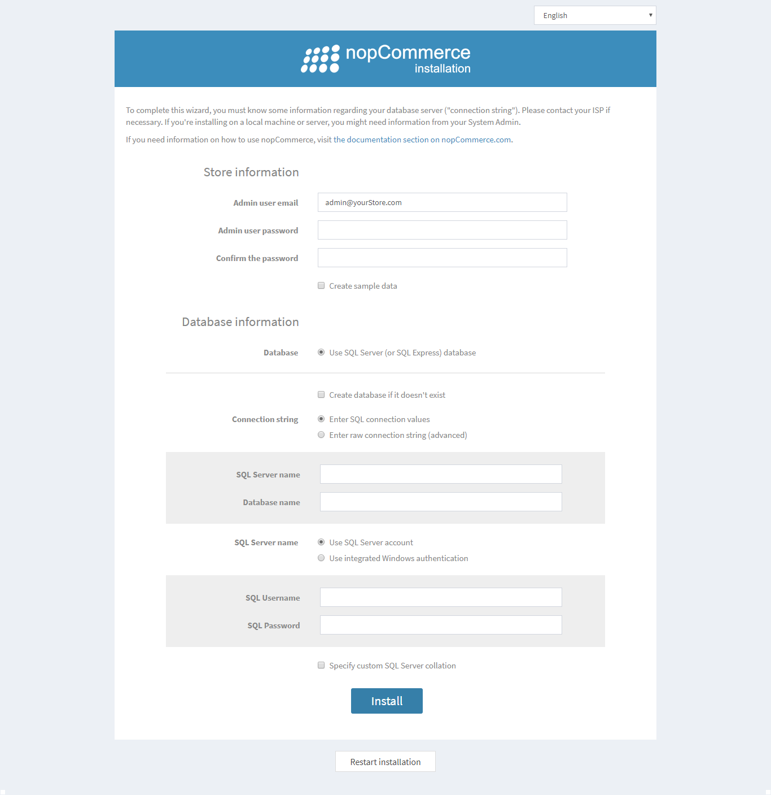

# Instruction on how to start developing on nopCommerce 4.2

## Summery

nopCommerce is open-source Microsoft ASP.NET based e-commerce solution. This is a basic guide for developers on how to start developing on nopCommerce.

## 1. Tools Required for Development

Please visit [System requirements](https://github.com/seasg/nopCommerce-Docs/blob/ramji/developer/tutorials/System%20requirements%20for%20developing.md) for detailed information

## 2. Stack of technologies used in nopCommerce.

The best part of nopCommerce is that its source code is fully customizable and its plug able architecture makes it easy to develop custom functionality and follow any business requirements by using plugin system. It follows well-known software architectures, patterns and the best security practices. And above all of that it runs on latest technologies to offer the best experience possible to end-users. So, in order to achieve all of this nopCommerce uses a stack of technologies in its architecture.

### 2.1. Application Layer

* #### [Razor View Engine](xref:https://docs.microsoft.com/en-us/aspnet/core/mvc/views/razor?view=aspnetcore-2.2)

    It is to render html page on client side.         Razor View engine is a markup syntax which helps us to write HTML and server-side code in web pages using C# or VB.NET.

* #### [Jquery](xref:https://jquery.com/)

    It is a javascript library used to extend the UI & UX functionality of html pages.

* #### [Kendo UI](xref:https://www.telerik.com/kendo-ui)

    Kendo UI is a comprehensive HTML5 user interface framework for building interactive and high-performance websites and applications

### 2.2. Business Layer

* #### [Fluent Validation](xref:https://fluentvalidation.net/)

    It is a validation library for .NET that uses a fluent interface and lambda expressions for building validation rules.

* #### [AutoMapper](xref:http://automapper.org/)

    AutoMapper is a simple library that helps us to transform one object type to another. It is a convention-based object-to-object mapper that requires very little configuration.

* #### [Autofac](xref:https://autofac.org/)

    Autofac is an addictive IoC container for .NET. It manages the dependencies between classes so that applications stay easy to change as they grow in size and complexity.

* #### [Entity Framework (EF) Core 2.2](xref:https://docs.microsoft.com/en-us/ef/core/)

    Entity Framework (EF) is an open-source ORM framework for .NET applications supported by Microsoft. It supports LINQ queries, change tracking, updates, and schema migrations. It enables developers to work with data using objects of domain specific classes without focusing on the underlying database tables and columns where this data is stored. So, it is the bridge between Business Layer and Data Layer. Entity Framework (EF) Core is the latest version of Entity Framework (EF) which is much faster compared to older version.

### 2.3. Data Layer

* #### [Microsoft SQL Server](xref:https://www.microsoft.com/en-us/sql-server)

    SQL Server is Microsoft's full-featured relational database management system (RDBMS).

* #### [Redis (cache)](xref:https://redis.io/)

    Redis is an open source (BSD licensed), in-memory data structure store, used as a database, cache and message broker. So, in nopCommerce Redis is used to store old data as in-memory cash dataset. Which boosts the speed and performance of application.

* #### [Microsoft Azure(Optonal)](xref:https://azure.microsoft.com/en-us/services/sql-database/)

    Azure is a public cloud computing platform with solutions including Infrastructure as a Service (IaaS), Platform as a Service (PaaS), and Software as a Service (SaaS) that can be used for services such as analytics, virtual computing, storage, networking, and much more. 

## 3. How to download the project and run it on the local machine.

Before we begin to work with nopCommerce we need to ensure that our local machine is configured and need to ensure that all of our tools required to develop in nopCommerce are installed properly and working correctly. Now, let us go to step by step instructions on how to download and run nopCommerce on our local machine.

### Step 1: Download nopCommerce source code.

To download please visit this site [nopCommerce](xref:https://www.nopcommerce.com/download-nopcommerce). There you can see two download buttons one with a source code and one without source code like shown in the picture below.

Since we are downloading nopCommerce for development purpose so we need to download the one that says “Package with source code” which contains all source code of nopCommerce. In order to download nopCommerce you need to be logged in or register a new account. Now you can download nopCommerce as a RAR file, and extract it to your desired folder location.

### Step 2: Open nopCommerce solution in Visual Studio.

Open the folder, Inside that folder you will see a bunch of files and folders which contains all of the sources code for nopCommerce.

In there you will also see a solution file with extension of `.sln`, please double click that solution file to open nopCommerce project in you `Visual Studio`.

### Step 3: Running nopCommerce project using Visual Studio.

nopCommerce does not require you to have any further configuration just to run the project. nopCommerce is ready to run out of the box. So, now you can run project using `Visual Studio` by hitting ctrl+f5 or just f5 to run project in debugging mode, or you can run using physical button with play icon in `Visual Studio`. After you run the project for the first time you will see a installation page like below:

Here you need to fill all required information to complete your installation.

**Store information:** Here you are required to provide an email address and password which then be used as your administrator account in your nopCommerce shop.

**Database information:** Here you need to provide your information you want to use for this project. Here you have two options for your database storage. `Use SQL Server (or SQL Express) database` For this you need to have Microsoft SQL Server installed in your system so that nopCommerce can create or access already created database which then can be used in our application. `Create database if it doesn't exist` If you already have nopCommerce database compatible with nopCommerce 4.2 and planning to use the same database then you don't need to check this checkbox otherwise please check this checkbox so that nopCommerce can create a new database for your application. Moving further you need to set up your connection string. For that, you have two options. One is `Enter SQL Connection Value`. If you choose this option then a form with `SQL Server name` and `Database name` will appear. In SQL Server name you need to provide your SQL server’s name and in Database name you need to provide a database name you want to create or if you already have one then it will not create but use the existing one. However, you also can choose the option `Enter raw connection string` then you need to write whole connection string by yourself. After that you need to provide your SQL server’s credentials for authentication.

After you fill all of this information you need to press “install” button, it may take couple of minutes to complete the installation, then you will be redirected to online shop homepage.

### 4. How to configure nopCommerce to run on HTTPS

In order to set SSL/HTTPS for your nopCommerce you need to go to the property window of Nop.Web project under Presentation folder since it is the startup project for nopCommerce. To open property window right click on Nop.Web project and at the bottom of the context menu you will see a menu named “Properties”, just click on that menu then a property window will appear. In property window navigate to “Debug” tab.

Check the "Enable SSL", and enter the HTTPS URL besides it. Then save this project.

Now run your project again and navigate to the given URL and you can see that now it is running on SSL/HTTPS. So this is the one way for configuring HTTPS in you WebProject but there is also another way to configure SSL. For that go to your Nop.Web project and expand the project inside there you will see a virtual file named “Properties” in your project structure just below “Dependencies”. Inside Properties there you will find a JSON file called launchSetting.json. Open that file and you will see bunch of configuration setting already written in that file. 

Inside that file you may have a section as shown in the figure above. So to enable SSL you just need to replace 0 under “sslPort” property to the port you want to run for SSL connection, make sure the port is available. To test, run your project and navigate to https://localhost:{yourport}.